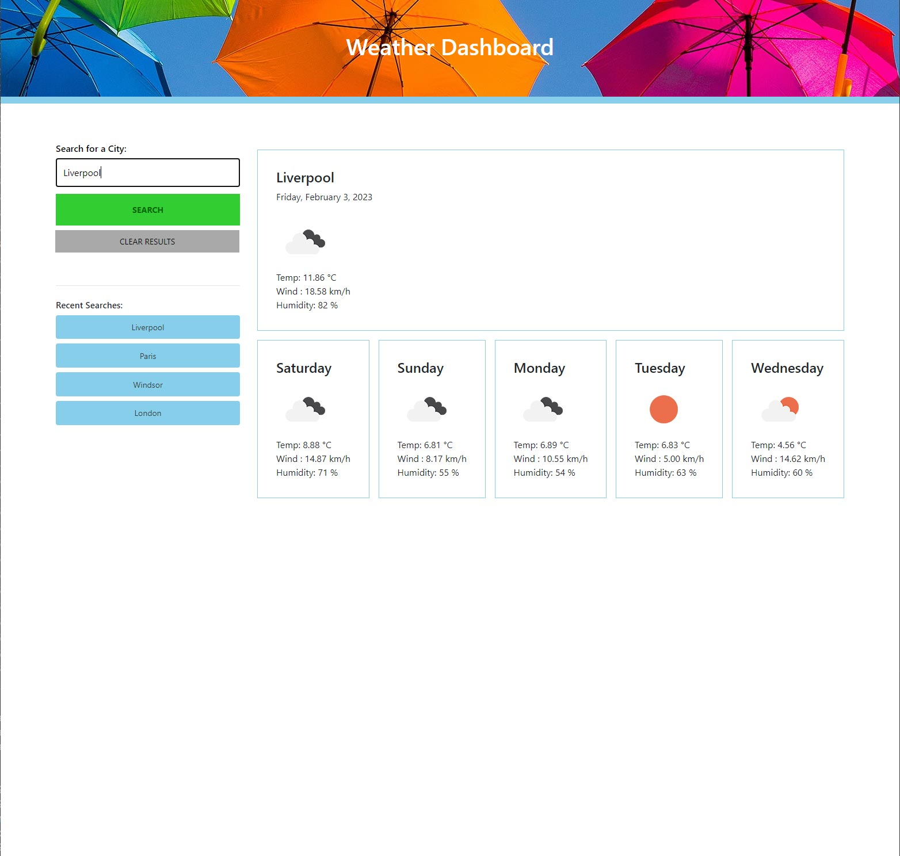

# Weather-Dashboard

## Description

Module 8 Server-Side APIs: Weather Dashboard. Build a weather dashboard that will run in the browser and feature dynamically updated HTML and CSS. Use the 5 Day Weather Forecast API from Open Weather Map to retrieve weather data for cities.

## User Story

```
AS A traveler
I WANT to see the weather outlook for multiple cities
SO THAT I can plan a trip accordingly
```

### Acceptance Criteria

* Create a weather dashboard with form inputs.

*When a user searches for a city they are presented with current and future conditions for that city and that city is added to the search history.

* When a user views the current weather conditions for that city they are presented with:

    * The city name

    * The date

    * An icon representation of weather conditions

    * The temperature

    * The humidity

    * The wind speed

* When a user views future weather conditions for that city they are presented with a 5-day forecast that displays:

    * The date

    * An icon representation of weather conditions

    * The temperature

    * The humidity

* When a user clicks on a city in the search history they are again presented with current and future conditions for that city.

### Deployed Application

View the deployed application for Module 8: Weather Dashboard  at [makemassair.github.io](https://makemassair.github.io/Weather-Dashboard).

### Screenshot



